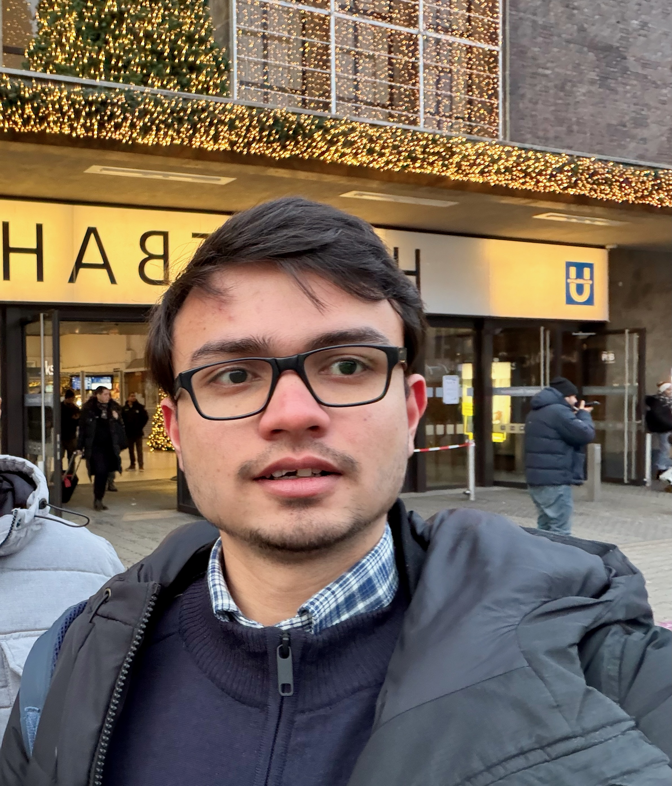
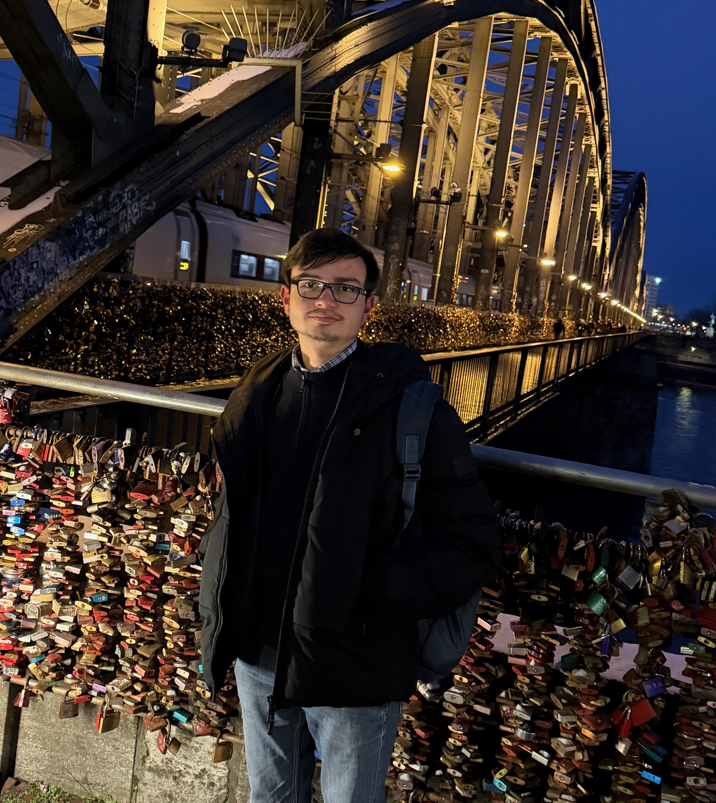

{width=5cm .float-right}
Hi there! I'm Ramanuj Raman, a physics enthusiast with a keen interest in every problem of physics I can get my hands on.
Currently, I am pursuing my Int-BSMS at the Indian Institute of Science Education and Research (IISER) Mohali. I am in my
 final year and working on my master's thesis on **Error Budget in Dispersive Readout** at PGI-8 (Instiute for Quantum
 Control), at Forschungszentrum Jülich, Germany, under the supervision of Prof. Dr. Felix Motzoi and Dr. F.A. Cardenas Lopéz.\
{width=5cm .float-left}
Before this I have worked on projects related to light-matter interaction including Jaynes-Cummings, Electromagnetically Induced
Transparency, simulation of phases of matter in Bose-Hubbard models, understanding topological phenomena in the SSH model and
Kitaev chain.\
My current interests lie in using techniques from quantum information theory to understand condensed matter systems, and in exploring
quantum control methods to improve qubit readout and gate fidelities.\
Apart from physics, I enjoy coding, photography, philosophy and writing poems. I have experience working with julia and python for
simulations of quantum system and other physical systems in general. I also like to teach and solve problems which has lead me run a
semi-active youtube channel [R2E](https://youtube.com/@r2e_?si=35W1omgmFOPEemBV) and I also like to talk to fellow physicist on problems
and there prespectives on things.\
*Feel free to explore my [notes](notes.qmd) and [blogs](blogs.qmd) to learn more about my work and thoughts. If you want more about my
professional experience please look at my CV [here](assets/Ramanuj_CV.pdf)*\

## Update Log
- **27 April 2026:** Defended my master's thesis and will also graduate in June. If you are interested in what I spent my whole year on you can check out my thesis (unsigned version) [here](assets/Ramanuj_Thesis.pdf).
- **19 January 2026:** Started on my notes for theory of angular momentum and purcell filter. Hope I'll finish it ... as soon as I can.
- **12 January 2026:** Redesigned the website layout for...idk fun I guess. Just kidding, I wanted a cleaner look and better way to organize
  and present my notes and blogs.

## Contact
- 📧 **Email:** [ramanujraman@icloud.com](mailto:ramanujraman@icloud.com)
- 💼 **LinkedIn:** [linkedin.com/in/ramanuj-raman](https://www.linkedin.com/in/ramanuj-raman-1ba49a210/)
